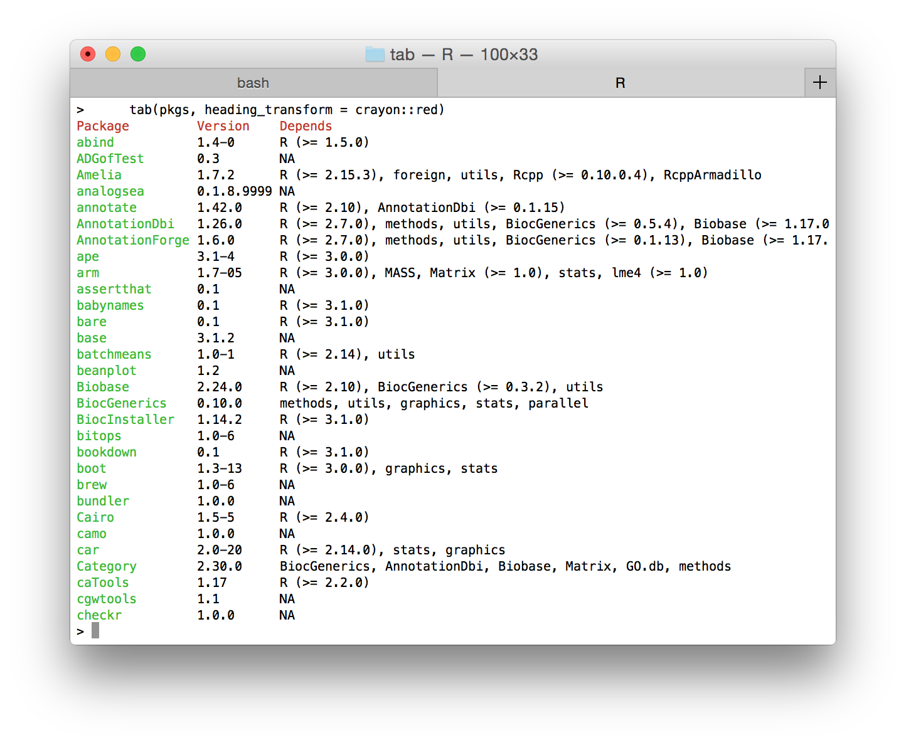

```{r, setup, echo = FALSE, message = FALSE}
knitr::opts_chunk$set(
  comment = "#>",
  tidy = FALSE,
  error = FALSE,
  fig.path = "",
  fig.width = 8,
  fig.height = 8)
```

# tab

> Pretty tables at the R CLI

For better user interface. Inspired by the
[columnify](https://github.com/timoxley/columnify) project.



## Install

Install from Github with `devtools`. You'll also need a recent `crayon` package:

```{r, eval = FALSE}
install.packages("devtools")
devtools::install_github("gaborcsardi/crayon")
devtools::install_github("gaborcsardi/tab")
```

## Usage

Call `tab` with your data frame. Here are some examples.

```{r}
library(tab)
data <- data.frame(pkg = c("igraph", "crayon", "tab"),
                   version = c("0.7.1", "1.1.0", "1.0.0"))
tab(data)
```

### Maximum and minimum column widths

```{r}
x <- data.frame(
  stringsAsFactors = FALSE,
  pkg = c("igraph", "crayon", "tab"),
  version = c("0.7.1", "1.1.0", "1.0.0"),
  description = c(
    paste("Routines for simple graphs and network analysis.",
      "igraph can handle large graphs very well and provides",
      "functions for generating random and regular graphs,",
      "graph visualization, centrality indices and much more."),
    paste("Crayon adds support for colored terminal output on",
      "terminals that support ANSI color and highlight codes.",
      "ANSI color support is automatically detected.",
      "Colors and highlighting can be combined and nested. New styles",
      "can also be created easily. This package was inspired by",
      "the chalk JavaScript project"),
    paste("Pretty Tables in the terminal. Pretty print a data frame",
       "in the R terminal. Supports word wrapping,\ncell truncation,",
       "ANSI colors, column names, alignments, padding")
  )
)
tab(x)
tab(x, min_width = 10, max_width = 50)
```

### Maximum table width

```{r}
tab(x, table_width = 50)
```

### Align right or center

```{r}
tab(data, align = "right")
tab(data, align = "center")
```

### Padding character

```{r}
tab(data, padding_chr = ".")
```

### Preserve existing newlines

```{r}
x2 <- data.frame(V1 = c("This is a line with \n newlines \nin it",
                        "And another line"),
	 	 V2 = c("and this is just a long line",
 	 	        "and a short one")
                )
tab(x2, preserve_newlines = TRUE, max_width = 20)
```

### Custom column splitter


```{r}
tab(data, column_splitter = " | ")
```

## License

MIT © Gabor Csardi
